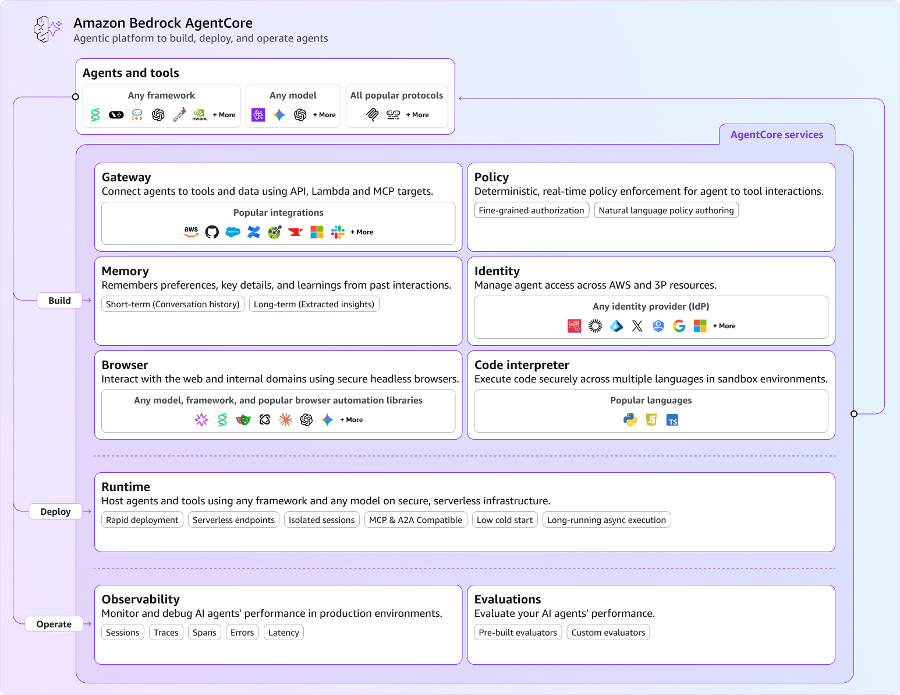
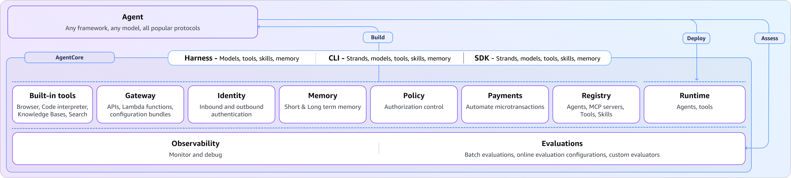

<!-- _class: title -->

# Amazon Bedrock AgentCore


## A Field Guide for AWS Builders

Rowan Udell - AWS Security Hero & Consultant
AWS Brisbane Usergroup, April 2026

---

## Hi, I'm Rowan 👋


- **AWS Security Hero**
- Independent consultant
- Using AWS for **15+ years**
- Helping businesses **build and secure agents**

---

## The Problem with AI Agents Today

* Prototypes are easy. **Production is hard.**

* Every team re-invents the same things:
    - Hosting and scaling agent code
    - Memory and session management
    - Authentication and authorization
    - Tool integration
    - Observability and evaluation

* AgentCore is the **platform layer** between your agent code and production.

---

## What is Amazon Bedrock AgentCore?

A suite of **10 composable services** for building, running, and governing AI agents.

* Not a new framework. It's **infrastructure for agents**
* **Framework-agnostic**: LangGraph, CrewAI, Strands, custom code
* **Model-agnostic**: Bedrock, Claude, OpenAI, Gemini, whatever
* Use what you need, skip what you don't

---



---



---

## What AgentCore Is Not

* Not the `agentcore` CLI
* Not **Bedrock Agents**
  - AgentCore = infrastructure; Bedrock Agents = opinionated orchestration
* Not a new agent **framework**: bring your own
* Not **limited to Bedrock models**: works with any LLM
* Not a monolith: each service is **independently useful**

---

## Release Timeline

- **Jul 2025**: Preview launch (4 regions)
  Runtime, Memory, Gateway, Browser, Code Interpreter, Observability, Identity
- **Oct 2025**: GA (9 regions)
  VPC support, A2A protocol, MCP server connectivity
- **Dec 2025**: Policy & Evaluations *(preview)*
  Episodic memory, bidirectional streaming
- **Mar 2026**: Policy GA *(13 regions)*, Evaluations GA *(9 regions)*
- **Apr 2026**: Registry *(preview, 5 regions)*

---

<!-- _class: title -->

# Build Your Agent
Gateway · Policy · Memory · Identity · Browser · Code Interpreter

---

## Gateway

Turn APIs into **MCP-compatible tools**, without code.

* **Centralized & secure**: VPC Lattice, built-in auth
* **Semantic tool discovery**: find the right tool
* **Import from anywhere**: Lambda, OpenAPI, Smithy
* **Credential injection**: per-tool auth
* **Composition**: multiple APIs in a single MCP
* **1-click integrations**: Slack, Jira, GitHub, Salesforce, Zendesk


---

## Policy

Fine-grained access control using **Cedar**, enforced *outside* agent code.

```
forbid(
  principal,
  action == AgentCore::Action::"PaymentTools__transfer_funds",
  resource
) when { context.amount > 10000 };
```

* **Declarative**: outside prompts and agent logic
* **Granular interception**: gateway/tool/operation/etc
* **Safe rollout**: LOG_ONLY, then ENFORCE
* **Schema validation**: generates from Gateway tools
* **Natural language authoring**


---

## Memory

Give agents the ability to **remember**.

* **Managed**: no DDB tables, encrypted with KMS
* **Short-term**: session context, conversation history
* **Long-term**: preferences, facts, semantic (async)
* **Multi-agent sharing**

<!-- Key talking points:
- Short-term memory is per-session — raw conversation events, up to 365 days retention
- Long-term memory is cross-session — async extraction via strategies: UserPreference, Semantic, SessionSummary, Episodic
- "No DynamoDB tables" is the pitch — you don't manage storage, indexes, or TTLs
- Multi-agent memory sharing is important for supply chain, support escalation, or any workflow where agents hand off
- Episodic memory (added Dec 2025) captures structured episodes: scenario, intent, actions, outcomes, reflections
- Summarisation uses advanced prompt templates and runs async — may take a few minutes after session ends
-->


---

## Identity

First-class identity for agents, not just IAM roles.

* **Multi-credential**: OAuth2 tokens, API keys, client certs, SAML, custom tokens
* **OAuth flows**: client credentials (2LO) + authorization code (3LO)
* **Helpful SDK**: annotations reduce boilerplate, automatic token refresh
* **Request verification**: signature/expiry/scope validated on every call
* **Audit trail**: credential access logged

<!-- Key talking points:
- This is NOT just "give the agent an IAM role" — it's a proper workload identity system
- Token vault encrypts at rest AND in transit, validates every access independently
- 3LO (authorization code) is the flow where a human consents — agent gets scoped tokens, not your password
- 2LO (client credentials) is machine-to-machine — agent authenticates as itself
- Identity propagation means downstream services see BOTH the agent identity AND the user identity
- Declarative annotations in the SDK mean you don't write OAuth boilerplate — just annotate which credentials you need
- Cross-service agents (agent calling agent) maintain identity chain — no "confused deputy"
-->


---

## Browser

Sandboxed web browsing agents can use at runtime.

* **Isolated Chromium**: one microVM per session, full isolation
* **Playwright-based**: automation via WebSocket streaming API
* **Live View**: real-time monitoring powered by AWS DCV — embed in your app
* **Session recording**: replay saved to S3 for audit and debugging
* **Extensible**: browser extensions, profiles, proxies, enterprise policies
* **Configurable TTL**: sessions auto-terminate after timeout

<!-- Key talking points:
- MicroVM isolation (Firecracker) means one session cannot leak into another — full CPU/memory/filesystem separation
- Live View is a React component you can embed — uses AWS DCV (same tech as WorkSpaces) to stream the browser
- Playwright is the automation layer — same API devs already know from testing
- Session recording to S3 is great for compliance — replay exactly what the agent did
- Web Bot Auth reduces CAPTCHAs — not eliminates — so agents can navigate sites that would normally block bots
- Browser profiles let you persist cookies/settings across sessions (e.g. logged-in state)
- OS-level actions mean the agent can do things like file system operations on the VM, not just browser tabs
- Enterprise policies let you restrict which sites the browser can access
-->

---

## Code Interpreter

Sandboxed code execution agents can use at runtime.

* **Multi-language**: Python, JavaScript, TypeScript — common libraries pre-installed
* **Sandboxed**: containerized execution, isolated per session
* **Long-running**: default 15 min, extendable up to 8 hours
* **Data processing**: CSV, Excel, JSON — cleaning, analysis, visualisation
* **Internet access**: agents can fetch external data during execution (opt-in)
* **Framework integration**: Strands, LangChain, or direct SDK/boto3
* **CloudTrail logging**: code execution is auditable

<!-- Key talking points:
- Not just Python anymore — JS and TS are supported too
- Pre-installed libraries mean agents don't waste time pip installing numpy/pandas/etc
- 8-hour execution ceiling matches Runtime — good for batch data processing
- Direct invocation (no agent framework) is useful for "just run this code" use cases
- Code execution results stream back — you get incremental output, not just final result
- Containerized, NOT microVM like Browser/Runtime — different isolation model
-->

---

<!-- _class: title -->

# Deploy Your Agent
Runtime · Registry

---

## Runtime

Serverless hosting for AI agents. No infrastructure to manage.

* **Consumption-based pricing**: pay only for resources used
* **MicroVM isolation**: Firecracker, up to **8 hours**
* **Multi-protocol**: MCP, A2A, HTTP, WebSockets
* **Shell execution**: same container as agent
* **Persistent filesystem**

<!-- Key talking points:
- "Few lines of code" to go from local agent to cloud deployment — that's the pitch
- Firecracker microVMs are the same tech as Lambda — proven isolation model
- 8-hour sessions are a differentiator — most serverless has 15-min limits
- Persistent filesystem is unique — agent can install packages, write files, and they survive across invocations within a session
- A2A protocol support means agents can call other agents natively
- Scales to zero means you're not paying for idle — important for dev/test
- Shell execution lets agents run arbitrary commands in their sandbox — powerful but needs policy guardrails
- ADOT SDK integration for custom tracing/metrics out of the box
-->


---

## Registry

Centralized discovery and governance for your agent estate.

* **Catalog**: agents, tools, MCP servers, custom resources, with MCP-native access
* **Auto-discovery**: URL-based sync from live MCP servers and agent endpoints
* **Hybrid search**: natural language + keyword matching
* **Governance**: ownership, versioning, lifecycle metadata, approval workflows (+ EventBridge)
* **Flexible auth**: IAM or custom JWT for search and MCP invoke

<!-- Key talking points:
- Think of it as a "service catalog for agents" — who built what, where is it, is it approved
- Currently in Preview (April 2026) — 5 regions: us-west-2, us-east-1, eu-west-1, ap-northeast-1, ap-southeast-2
- Auto-discovery is smart — point it at a live MCP server URL and it pulls metadata automatically
- Hybrid search means "find me something that can send Slack messages" works alongside exact keyword matches
- EventBridge integration lets you plug into existing approval pipelines (ServiceNow, Jira, etc.)
- MCP-native endpoint means agents can discover and invoke tools from the registry directly
- Custom JWT auth is useful for multi-tenant SaaS platforms
- Deprecated records can be hidden from search but preserved for audit
-->


---

<!-- _class: title -->

# Operate Your Agents
Observability · Evaluations

---

## Observability

See what your agents are **actually doing**.

* **OpenTelemetry-compatible**: tracing to Amazon CloudWatch
* **Agent-aware**: tool calls, LLM invocations, latency, token usage, error rates
* **Auto-instrumented + extensible**: spans for Gateway, Memory, Tools, Policy out of the box
* **Multi-destination**: CloudWatch, S3, or Firehose
* **Not just Runtime**: agents hosted anywhere
* **ADOT SDK**: for custom instrumentation

<!-- Key talking points:
- "Out of the box" is key — deploy to Runtime and you get session metrics, spans, and logs automatically
- ADOT (AWS Distro for OpenTelemetry) SDK lets you add custom instrumentation — e.g. track business-specific metrics
- Spans cover the full chain: agent reasoning > tool selection > Gateway call > tool execution > response
- Works for agents NOT on AgentCore Runtime too — just configure ADOT SDK and point at CloudWatch
- Transaction Search in CloudWatch lets you trace a single request across agent > gateway > tools > memory
- Multi-destination logging means you can ship to S3 for long-term retention or Firehose for real-time analytics
- Policy spans show you what was evaluated and whether it was allowed/denied — useful for debugging access issues
-->


---

## Evaluations

Measure agent quality **systematically**.

* **LLM-as-a-Judge**
* **13+ built-in evaluators**: correctness, faithfulness, relevance, toxicity
* **Two modes**: on-demand (CI/CD) and online
* **Custom evals**: your own LLM or Lambda based
* **Reference answers**: compare outputs against expected answers and tool sequences
* **Session + trace level**: score individual turns or entire conversations
* **Framework integration**: Strands, LangGraph, OpenTelemetry trace format

<!-- Key talking points:
- Online mode continuously samples live traffic — set a percentage or filter by criteria
- On-demand mode is for CI/CD or investigating specific interactions — you pick the exact spans/traces
- Custom evaluators are the power feature — write a Lambda function with your own scoring logic
- Ground truth evaluators include trajectory matching: did the agent call the right tools in the right order?
- Three trajectory modes: exact order, in-order (allows extras), any-order (just checks presence)
- GoalSuccessRate evaluator takes natural language assertions — "the agent should have booked a window seat"
- Session-level vs trace-level matters: trace = one turn, session = entire conversation
- Built-in evaluators have public ARNs — custom evaluators are private to your account
- Each evaluator has its own ARN — can scope IAM permissions per evaluator
-->


---

## How the Services Fit Together


---

## Getting Started

Start small. You don't need all 10 services on day one.

Minimum viable agent stack:

1. **Runtime** to deploy your existing agent code
1. **Memory** when you need cross-session context
1. **Gateway** to connect it to tools

Then layer on:

- **Identity** when users need delegated access
- **Observability** to see what it's doing
- **Policy** when you need tool access control (start with LOG_ONLY)
- **Evaluations** before you promote to production

---

## Key Takeaways

1. AgentCore is **infrastructure for agents**, not another framework
2. **10+ services** that are individually useful and composable
3. Start with **Runtime + Memory + Gateway**
4. Use **Policy in LOG_ONLY** mode before enforcing
5. **Identity propagation** avoids the "agent uses a shared service account" anti-pattern
6. Treat agent security like application security, because it is (with some other stuff)

---

## Thanks!

Any questions?

**Slides** [slider.rowanudell.com 🍔](https://slider.rowanudell.com)
**Amazon Bedrock Agentcore** [Documentation](https://docs.aws.amazon.com/bedrock-agentcore/)
**Cedar playground** [cedarpolicy.com](https://cedarpolicy.com)
**Strands SDK** [on GitHub](https://github.com/strands-agents/sdk-python)
**AWS re:Post** [AgentCore tag](https://repost.aws/tags/TAaysfWwGaS3SNb1O0i1GkOg/amazon-bedrock-agentcore)


