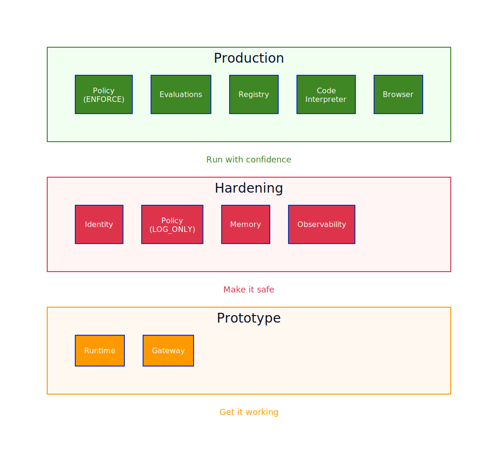

<!-- _class: title -->

# Amazon Bedrock AgentCore
## A Field Guide for AWS Builders

Rowan Udell · AWS Security Hero & Consultant
AWS Brisbane Usergroup · April 2026

---

## The Problem with AI Agents Today

Prototypes are easy. **Production is hard.**

Every team re-invents the same things:
- Hosting and scaling agent code
- Memory and session management
- Authentication and authorization
- Tool integration
- Observability and evaluation

AgentCore is the **missing platform layer** between your agent code and production.

---

## What is Amazon Bedrock AgentCore?

A suite of **10 composable services** for building, running, and governing AI agents.

- **Framework-agnostic**: LangGraph, CrewAI, Strands, custom code
- **Model-agnostic**: Bedrock, Claude, OpenAI, Gemini, whatever
- Use what you need, skip what you don't
- Not a new framework. It's **infrastructure for agents**

---


---

<!-- _class: title -->

# Build Your Agent
Gateway · Policy · Memory · Identity · Browser · Code Interpreter

---

## Gateway

Turn any API into an **MCP-compatible tool**, without writing glue code.

* **Import from anywhere**: Lambda, OpenAPI specs, existing APIs
* **1-click integrations**: Slack, Jira, GitHub, Salesforce, Zendesk
* **Semantic tool discovery**: agents find the right tool by description
* **Centralized & secure**: VPC Lattice, built-in auth


---

## Policy

Fine-grained access control using **Cedar**, enforced *outside* agent code.

* **Declarative policies**, not embedded in prompts or agent logic
* **Granular interception** at gateway, tool, operation, or parameter level
* **Safe rollout**: **LOG_ONLY** (shadow) → **ENFORCE** (block)

```
forbid(
  principal,
  action == AgentCore::Action::"HRTools__export_salary_report",
  resource
);
```

The agent doesn't decide its own permissions. **You do.**


---

## Memory

Give agents the ability to **remember**.

* **Short-term**: session context, conversation history, scratchpad
* **Long-term**: user preferences, facts, summaries (async consolidation)
* **Managed**: no DynamoDB tables, **encryption at rest** (KMS)


---

## Identity

First-class identity for agents, not just IAM roles bolted on.

* **Unique agent ARN**: each agent gets its own identity
* **OAuth 2.0** credential management + **credential vault** for 3rd-party tokens
* **User-delegated access**: agent acts *as* the user, not *instead of*
* Identity propagation through the full tool chain


---

## Browser

Sandboxed web browsing agents can use at runtime.

* **Isolated Chromium**: one instance per session, sandboxed
* **Full interaction**
  - Navigate, fill forms, click buttons, parse dynamic content
* **Audit & reliability**
  - **Session recording** for audit and debugging
  - Built-in CAPTCHA reduction

---

## Code Interpreter

Sandboxed code execution agents can use at runtime.

* **Sandboxed Python**: agents can write and run code dynamically
* **Rich capabilities**
  - Data analysis, calculations, file I/O within the sandbox
* **Flexible integration**
  - Direct invocation or framework integration

---

<!-- _class: title -->

# Deploy Your Agent
Runtime · Registry

---

## Runtime

Serverless hosting for AI agents. No infrastructure to manage.

* **Framework-agnostic**: any framework or custom Python, scales to zero
* **MicroVM isolation** (Firecracker): each invocation sandboxed, up to **8 hours**
* **Protocol-native**: MCP server, A2A protocol, WebSocket streaming


---

## Registry

Centralized discovery and governance for your agent estate.

* **Catalog**: register agents, tools, and MCP servers in one place
* **Governance**: ownership, version, lifecycle metadata + approval workflows
* **Multi-agent foundation**: cross-team discovery, MCP-native access


---

<!-- _class: title -->

# Operate Your Agents
Observability · Evaluations

---

## Observability

See what your agents are **actually doing**.

* **OpenTelemetry-compatible** tracing → **Amazon CloudWatch**
* **Agent-specific views**: tool calls, LLM invocations, decisions
* **Key metrics**: latency, token usage, error rates


---

## Evaluations

Measure agent quality **systematically**.

* **LLM-as-a-Judge**: use a model to evaluate agent outputs
* **13+ built-in evaluators**: correctness, faithfulness, relevance, toxicity
* **On-demand** (CI/CD) and **Online** (live traffic) modes


---

## How the Services Fit Together


---

## Prototype to Production



---

## Getting Started: Day 1

Start small. You don't need all 10 services on day one.

**Minimum viable agent stack:**
1. **Runtime**: deploy your existing agent code
2. **Gateway**: connect it to one or two tools
3. **Observability**: see what it's doing

**Then layer on:**
4. **Memory**: when you need cross-session context
5. **Policy**: when you need tool access control (start with LOG_ONLY)
6. **Identity**: when users need delegated access
7. **Evaluations**: before you promote to production

---

## Quick Start (CLI)

```bash
# Create a gateway with tools
aws bedrock-agentcore create-gateway \
  --gateway-name my-tools \
  --tool-configs file://tools.json

# Create a runtime endpoint
aws bedrock-agentcore create-runtime-endpoint \
  --runtime-name my-agent \
  --framework-config '{"type": "CUSTOM"}'

# Deploy your agent
aws bedrock-agentcore deploy-agent \
  --runtime-id $RUNTIME_ID \
  --agent-config file://agent.json
```

---

## What AgentCore Is Not

- Not a replacement for **Bedrock Agents** (managed orchestration)
  - AgentCore = infrastructure; Bedrock Agents = opinionated orchestration
- Not a new agent **framework**: bring your own
- Not **limited to Bedrock models**: works with any LLM
- Not a monolith: each service is **independently useful**

---

## Key Takeaways

1. AgentCore is **infrastructure for agents**, not another framework
2. **10 services** that are individually useful and composable
3. Start with **Runtime + Gateway + Observability**
4. Use **Policy in LOG_ONLY** mode before enforcing
5. **Identity propagation** solves the "agent uses a shared service account" anti-pattern
6. Treat agent security like application security, because it is

---

## Resources

- **AgentCore docs**: AWS Bedrock AgentCore User Guide
- **Cedar playground**: cedarpolicy.com
- **Strands SDK**: github.com/strands-agents/sdk-python
- **AWS re:Post**: search "AgentCore"

---

<!-- _class: title -->

# Thanks!

Rowan Udell
AWS Security Hero & Consultant

auditready.cloud


