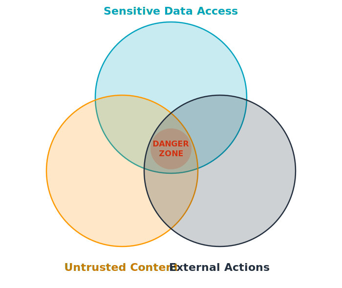
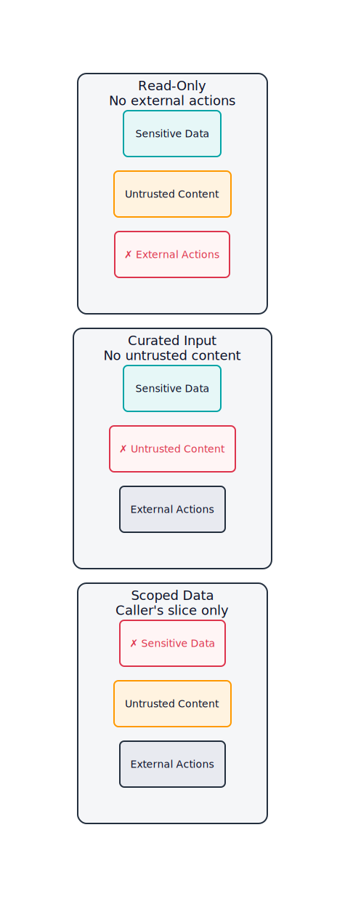

<!-- _class: title-dark -->
<!-- _paginate: skip -->

# Securing Amazon Bedrock AgentCore
A Practical Framework
Rowan Udell • AWS Summit Sydney • April 2026

---

<!-- _class: divider -->
<!-- _paginate: skip -->

# Agents Are Software.
Treat them like software.

---

# What Makes Agents Different?

**Traditional App**

Deterministic execution

* Fixed control flow
* Clearly scoped permissions
* Predictable I/O

**AI Agent**

Probabilistic outcomes are a feature, not a bug

* Broad access patterns
* Dynamic tool selection
* Untrusted content in the loop

---

<!-- _class: divider-teal -->
<!-- _paginate: skip -->

# The Lethal Trifecta
Simon Willison, 2025

---

# A Dangerous Combination

* One or two? Manageable.
* All three?

---

# A Dangerous Combination

---

# Meet the Tax Assistant

An AI agent that helps Australians with tax returns, deductions, and financial planning

It has access to **financial records**, processes **documents** from users, and **takes actions** with the ATO and banks

Any concerns?

---

# All Three Legs

**Sensitive Data**

TFNs, bank accounts, super balances, prior returns.

**Untrusted Content**

Uploaded receipts, forwarded statements, RAG results.

**External Actions**

Lodge returns, submit BAS, initiate transfers.

---

<!-- _class: divider -->
<!-- _paginate: skip -->

# Guardrails that are 95% effective
are not reliable enough.

---

<!-- _class: divider-teal -->
<!-- _paginate: skip -->

# "Old school" security
is still your best friend.

---

# The Fundamentals Haven't Changed

* **Least privilege** - don't give agents permissions they don't need
* **Defense in depth** - IAM, VPC, Guardrails, Cedar policies: independent layers that assume the others can fail
* **Separation of concerns** - multi-agent architectures scope capabilities and contain blast radius
* **Audit everything** - you can't secure what you can't see
* **Get identity right** - agents should act as users, not as omnipotent service accounts

---

<!-- _class: divider -->
<!-- _paginate: skip -->

# Break a Leg
The trifecta is only lethal with **all three**.

---

# Three Patterns

Pick a leg to remove. If you can't, you're carrying all three.

---

# Three Patterns, Practically

**Read-Only**

The agent thinks, doesn't act.

* No writes, no submissions
* Output goes back to the user
* *Assistants, advisors, summarisers*

**Curated Input**

You control what the agent sees.

* Structured payloads only
* No documents, no scraping, no email
* *Anything that moves money*

**Scoped Data**

Caller's slice only.

* No cross-tenant access
* User identity flows with every call
* *Multi-tenant SaaS*

AgentCore makes each pattern cheap: Cedar `forbid` rules, Gateway schemas, Memory namespaces.

---

# Back to the Tax Assistant

One scary monolith → three boring sub-agents. Each one provably missing a leg.

---

# Verify It Sticks

A regression that adds a leg back is a security incident.

* **AgentCore Observability** — full session replay, every tool call traced
* **AgentCore Evaluations** — pre-deployment testing plus always-on scoring in production

You can't claim a leg is removed if you can't prove it stayed removed.

---

<!-- _class: divider-teal -->
<!-- _paginate: skip -->

# What To Do Tomorrow

---

# Four Things

1. For each agent, **name the leg you removed.** If you can't, you're holding all three.
1. **Decompose** multi-leg agents into single-purpose sub-agents.
1. Enforce leg-removal **outside** agent code — policies, gateways, identity.
1. **Verify** with observability and evaluations. Treat regressions as incidents.

---

<!-- _class: divider -->
<!-- _paginate: skip -->

# Agents Are Software.
**Secure** them like software.

---

<!-- _class: title-dark centered -->
<!-- _paginate: skip -->

# Thank You!

~~Questions?~~ No time for questions! Happy to chat after 🤙

I help teams move agents from prototype to production

