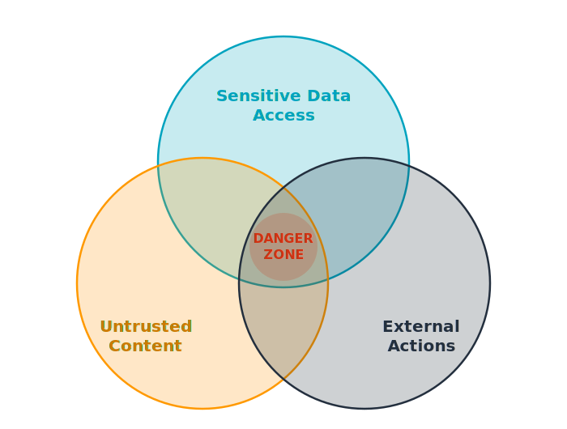

<!-- _class: title -->

# What is an agent?

Rowan Udell

---

## It started with a task

I typed one sentence. A few minutes later: a file was edited, tests ran, a PR was open. I hadn't touched the keyboard.

**A chatbot talks. An agent does.**

---

<!-- reveal: on -->

## Is it an agent?

**Thermostat**
* Has a goal. Takes fixed actions. Check results.
* **Not** an agent

**Chatbot**
* Responds to input. Takes no actions. Doesn't observes results.
* **Not** an agent

**Claude Code**
* Has a goal. Takes actions. Observes results. Makes a decision.
* It's an agent

---

## An agent...

* Has a **goal**
* Takes **actions** and observes **results**
* Decides **what to do next**, then optionally repeats

---

## Not an Agent: It's a Chatbot

Input in. One LLM call. Output out.


---

## Not an Agent: It's a Workflow

Orchestrate multiple LLM calls: route, branch, combine results.


---

## It's an Agent

Act on the environment. Observe feedback. Decide what to do next. Repeat until done.


Also known as **ReAct** (Reason + Act).

---

## Stopping condition

Every loop needs a way to **stop**

<div class="columns">
<div>

**Vague**
- "Make the code better"
- "Research the topic"

</div>
<div>

**Concrete**
- "All tests pass, no lint errors"
- "Summarise in 3 bullet points"

</div>
</div>

---

## The model is the decider

* Reads the goal, the results so far, and the available tools
* Decides: **which tool**, with **which inputs**, or **stop**
* Claude, GPT-4o, Gemini: same loop, different reasoning quality

---

## Tools are the hands

* A tool is any function the model can call: search the web, run code, edit a file, call an API
* The model chooses; the harness executes and returns the result
* No tools: chatbot. Right tools: real work.

```json
// Model outputs a structured tool call:
{ "tool": "web_search", "query": "current AUD to USD exchange rate" }

// Harness runs it. Model receives:
{ "result": "1 AUD = 0.6421 USD (as of 09:14 AEST)" }
```

---

<!-- _class: title -->

# Demo

Take a suggestion from the floor.

---

## The harness is the real engineering


* Runs the loop: calls the model, routes tool calls, feeds results back
* Manages errors, context length, memory, retries
* **Claude Code is a harness.** Most production agents are mostly harness.

---

## The Lethal Trifecta



- **Untrusted content** (prompt injection)
- **Sensitive data** (exfiltration risk)
- **External actions** (real-world impact)

The model can't be trusted 🫤

---

<!-- _class: title -->

# Back to that task

The file was edited. Tests ran. A PR was open.

Now you know what it was doing.

---

## A Shared Mental Model

Now that you agree on what an agent is...

- How do you trust it?
- How do you hold it accountable?
- How do you know when NOT to let an agent do it?
